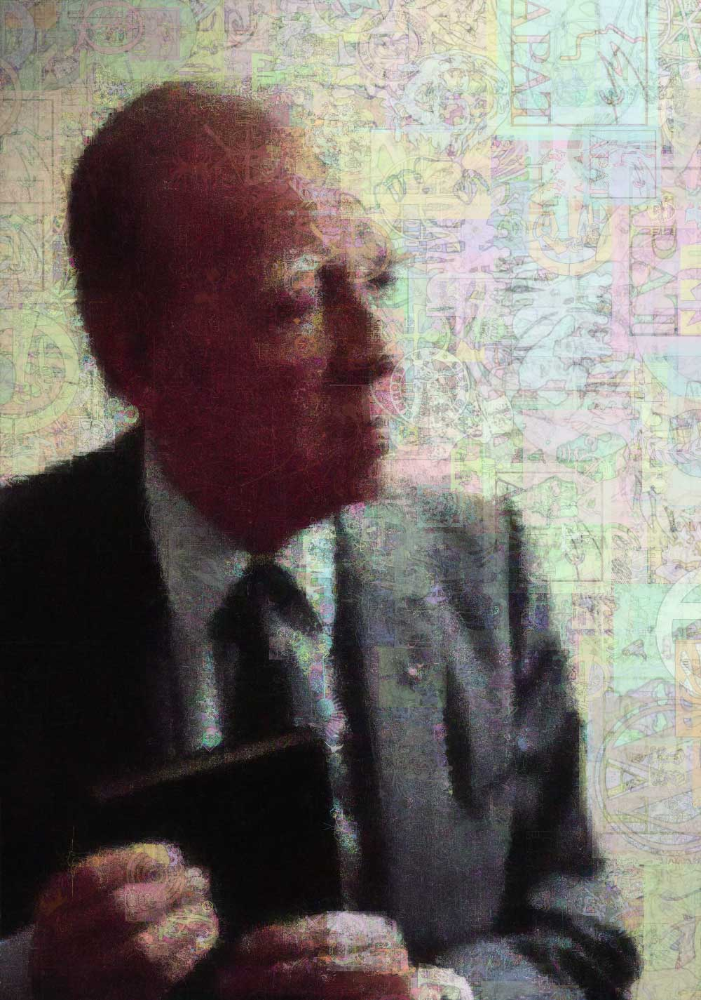

<h1>Pierre Menard and the Infinity Monkeys</h1>

This is an experimental project, built with openframeworks 0.8, the purpose of which is to randomly draw images and rapidly match them to an "ideal," in the manner of Pierre Menard attemping to "write" Don Quixote -- or infinite monkey creating Shakespeare on their little monkey typewriters. You can read more about the process <a href="http://omegra.net/portfolio">here</a>.

<h2>How to make a Pierre Menard</h2>

In the bin/data folder, create a folder for your "sample" images. Sample images should be line drawings of the sort that a Google image search returns when you select 'Line Drawing' in the search options menu.

Next, create and "output" folder in "bin/data." This is where the program will output its drawings, once every thousand "improvements."

Now just change the like in ofApp.cpp that points to the sample folder, so that it points to your samples.
 